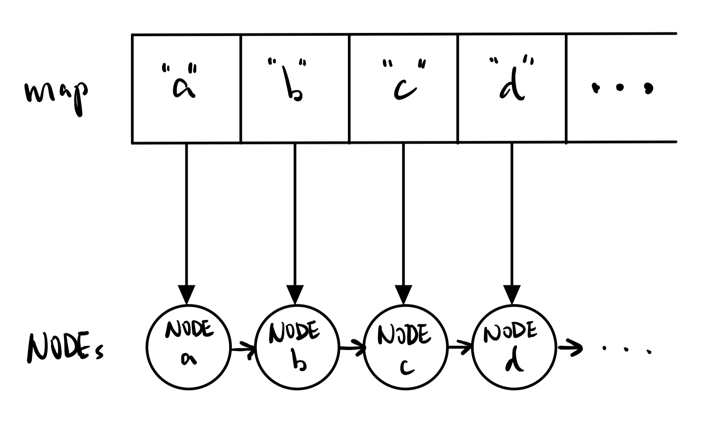
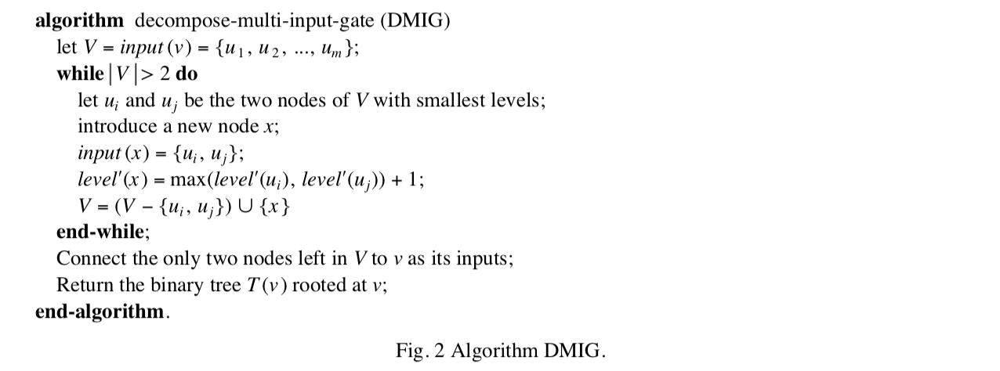
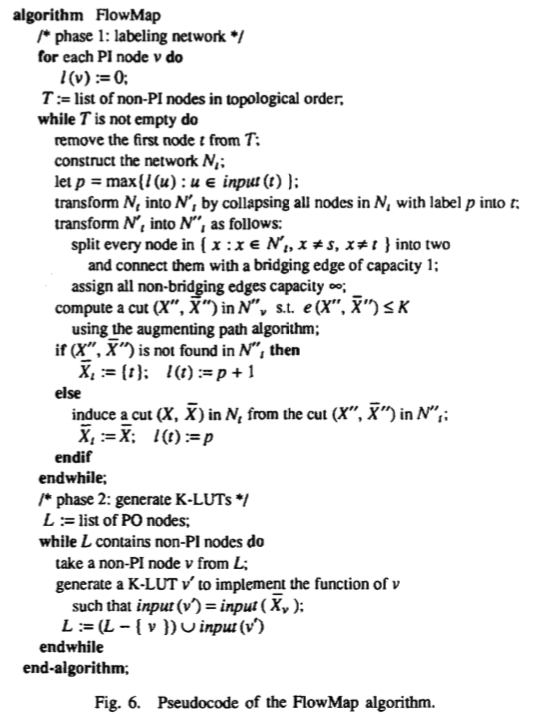

# Advanced Logic Synthesis Final Project Report

## Data Structure

每個 node 的定義如下：

```cpp
struct NODE{
	int NODE_level;

	std::string NODE_name;

	// Define NODE type
	std::string NODE_type;

	// Input nodes
	std::vector<std::string> InNODEs;

	// Output nodes
	std::vector<std::string> OutNODEs;
};
```
利用 `NODE.InNODEs` 來記錄所有連到該 node 的 node 們；利用 `NODE.OutNODEs` 來記錄所有該 node 連到的 node 們。
在建立 graph 的時候則是利用 `std::map<std::string, NODE>` 來連結 node name 及其 `NODE`  結構。
示意圖如下：


## Algorithm
### Stage1: Minimum Level Two-input Decomposition

在這一部分，我選擇使用由 Chen, K-C., et al. [1] 所提出的 decompose-multi-input-gate (DMIG) 演算法來實作。該演算法從 primary inputs 開始，依照拓樸順序，為不同 node 標上不同 level，如果遇到 node 的 input nodes 數量大於 2，則建立一個新的 node，並從其 input nodes 中挑出兩個 level 最小的 nodes 指向新生成的 node，再將新生成的 node 指向原本 input nodes 數量大於 2 的 node。
其 pseudocode 如下：



跑完 DMIG 演算法，就可以得到一個所有 node 最多只有 2 input nodes 的 graph。

### Stage2: Delay Optimal FPGA Technology Mapping

在這一部分，我則是選擇實作由 Cong, Jason et al. [2] 提出的 FlowMap 演算法。該演算法分成兩部分，第一部份為 labeling phase，第二部分則為 generating K-LUT phase。
在 labeling phase 中，首先定義 primary input 的 lebel 為 0，並沿著拓樸順序將非 primary inputs 的 node 抓出來做 labeling。其方法為：先產生一張 output 為被抓出來的 node 的新 graph， 再將抓出來的 node 給予其 input nodes 中最大的 label 值，並將所有同為該 label 的 node 包在一起，形成新的 node 並調整其他 node 與新 node 間的連結關係。接著加入一個 sink node 讓它連向所有 primary inputs。如此一來，可以得到一張新的 graph，並對其做 min cut，但這邊的 min cut 是要切在 node 上。要將現有的切在 edge 上的 min cut 演算法應用在這邊，就必須先將 graph 轉換成除了 sink 跟包在一起的大 node 以外的所有 nodes 一分為二，並給予連結兩者的新的 edge 權重為 1，而原本連結不同 nodes 的 edge 則賦予權重為無限大，但是在實作的時候，如果直接給 `INT_MAX`，則會在算權重總和時產生 overflow 的問題，引此在實作中我以 10000 代替。
有了這樣一張 edge 上有權重且 output 為被抓出來的 node 的 graph 後，我們就可以對其做 min cut，如果有辦法切出一刀權重和小於等於 `k` 的話，就代表那些被包在一起的 nodes 是真的可以被包在一起的，而且新的 LUT 則是以那刀切到的 node 為新的 input signals；如果沒有辦法切出這樣一刀，就代表那些 nodes 不該被包在一起，這時候被抓出來的 node 就要獨立出來，並將原本暫定的 label +1 成為它新的 label 。
在 generating K-LUT phase 中，我們從 primary output 開始，將非 primary input 的 node 抓出來，並把從上一個 phase 所得到 output 為該 node 的 LUT input signals 加入搜尋行列。同時產生一張 K-LUT 取代那些被包在一起的 nodes 所代表的 function。可惜在這步驟，我還沒有想到一個好的方法去實作，有想說是不是可以直接把所有可能的 input 組合丟進去，並挑出所有 output 為 1 的組合。
整個 FlowMap 演算法的 pseudocode 如下：



## Results

### Stage1: Minimum Level Two-input Decomposition

```bash
#!/bin/bash

for f in `find blif/*.blif`
do 
	echo $f
	./map -k 2 $f output.blif
	~/abc/abc -c "cec $f output.blif" # Equivalence check
done
```

由於設定 `-k 2`，相當於做 stage 1 的 decomposition，在用以上程式碼批次跑範例測資後可以得到結果如下。
可以看出程式所輸出的 decomposed network 和原測資是 equivalent 的。

```commandline
[kjhuang20@ic55 ~/ALS_Final]$ bash go.sh
blif/10aoi_9symml.blif
ABC command line: "cec blif/10aoi_9symml.blif output.blif".

Networks are equivalent.  Time =     0.01 sec
blif/10aoi_alu4.blif
ABC command line: "cec blif/10aoi_alu4.blif output.blif".

Networks are equivalent.  Time =     0.03 sec
blif/10aoi_big2.blif
ABC command line: "cec blif/10aoi_big2.blif output.blif".

Networks are equivalent.  Time =     1.19 sec
blif/10aoi_C1355.blif
ABC command line: "cec blif/10aoi_C1355.blif output.blif".

Networks are equivalent.  Time =     0.01 sec
blif/10aoi_C6288.blif
ABC command line: "cec blif/10aoi_C6288.blif output.blif".

Networks are equivalent after structural hashing.  Time =     0.00 sec
blif/10aoi_cht.blif
ABC command line: "cec blif/10aoi_cht.blif output.blif".

Networks are equivalent.  Time =     0.01 sec
blif/10aoi_cm138a.blif
ABC command line: "cec blif/10aoi_cm138a.blif output.blif".

Networks are equivalent.  Time =     0.01 sec
blif/10aoi_des.blif
ABC command line: "cec blif/10aoi_des.blif output.blif".

Networks are equivalent.  Time =     0.45 sec
blif/10aoi_i2.blif
ABC command line: "cec blif/10aoi_i2.blif output.blif".

Networks are equivalent.  Time =     0.01 sec
blif/10aoi_i3.blif
ABC command line: "cec blif/10aoi_i3.blif output.blif".

Networks are equivalent.  Time =     0.02 sec
blif/10aoi_i4.blif
ABC command line: "cec blif/10aoi_i4.blif output.blif".

Networks are equivalent.  Time =     0.01 sec
blif/10aoi_k2.blif
ABC command line: "cec blif/10aoi_k2.blif output.blif".

Networks are equivalent.  Time =     0.05 sec
blif/10aoi_sample01.blif
ABC command line: "cec blif/10aoi_sample01.blif output.blif".

Networks are equivalent after structural hashing.  Time =     0.00 sec
blif/10aoi_sample02.blif
ABC command line: "cec blif/10aoi_sample02.blif output.blif".

Networks are equivalent.  Time =     0.01 sec
blif/10aoi_z4ml.blif
ABC command line: "cec blif/10aoi_z4ml.blif output.blif".

Networks are equivalent.  Time =     0.01 sec
```

### Stage2: Delay Optimal FPGA Technology Mapping

```bash
#!/bin/bash

for f in `find blif/*.blif`
do 
	echo $f
	./map -k 4 $f output.blif
	echo -n '#Level: '
	~/abc/abc -c "read_blif $f;print_stats;" | grep 'lev =' | awk '{print $21}' # Level
	echo -n '#LUT: '
	grep .name $f | wc -l # LUT
done
```

由於 FlowMap 輸出 K-LUT 的部分還沒實作完成，所以先不實際輸出 `output.blif`  和原 circuit 做 equivalence check。
但 stage 2 即使不輸出 K-LUT 來取代原 function，我們依然可以算出新的 network 有多少 level 及 LUT 數量。
其結果如下：
`#Level` 和 `#LUT` 分別代表原 circuit 的 level 和 LUT 數量。 
由於 FlowMap 主要是最小化深度，從結果中也可以看出 level 的確有大幅降低；在 LUT 數量的部分則是在有些測資會比原 circuit 的 LUT 數量大，這可能是由於原 circuit 是任意 input number 而我們生成的結果則是壓在 `k` input，LUT 數量變多也是可以預期的。
在跑過實驗後，發現程式運行時間很長，就沒有全部測資都跑完，可能是實作上的問題，寫程式的技巧還需要加強。

```commandline
[kjhuang20@ic55 ~/ALS_Final]$ bash go.sh
blif/10aoi_9symml.blif
The circuit level is 6.
The number of LUTs is 110.
#Level: 11
#LUT: 162
blif/10aoi_alu4.blif
The circuit level is 11.
The number of LUTs is 794.
#Level: 29
#LUT: 548
blif/10aoi_big2.blif
The circuit level is 9.
The number of LUTs is 5827.
#Level: 17
#LUT: 2953
blif/10aoi_C1355.blif
The circuit level is 4.
The number of LUTs is 144.
#Level: 33
#LUT: 643
.
.
.
```

## References
[1] Chen, K-C., et al. "DAG-Map: Graph-based FPGA technology mapping for delay optimization." IEEE Design & Test of Computers 9.3 (1992): 7-20.
[2] Cong, Jason, and Yuzheng Ding. "FlowMap: An optimal technology mapping algorithm for delay optimization in lookup-table based FPGA designs." IEEE Transactions on Computer-Aided Design of Integrated Circuits and Systems 13.1 (1994): 1-12.